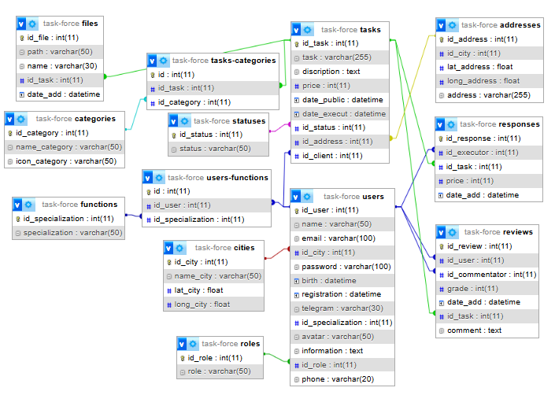

# Личный проект «TaskForce»

* Студент: Тимакова Надежда.

«TaskForce» — это онлайн площадка для поиска исполнителей на разовые задачи. Сайт функционирует как биржа объявлений, где заказчики — физические лица публикуют задания. Исполнители могут откликаться на эти задания, предлагая свои услуги и стоимость работ.

[Техническое задание]()

## В процессе работы над проектом были изучены:

* Основные принципы ООП

* Классы:
    * Композиция
    * Наследование
    * Абстрактные классы
    * Агрегация классов ?
    * Интерфейсы

* Обработка исключений и создание своих экземпляров

---

Репозиторий создан для обучения на профессиональном онлайн‑курсе «[PHP, уровень 2](https://htmlacademy.ru/intensive/php2)» от [HTML Academy](https://htmlacademy.ru).

